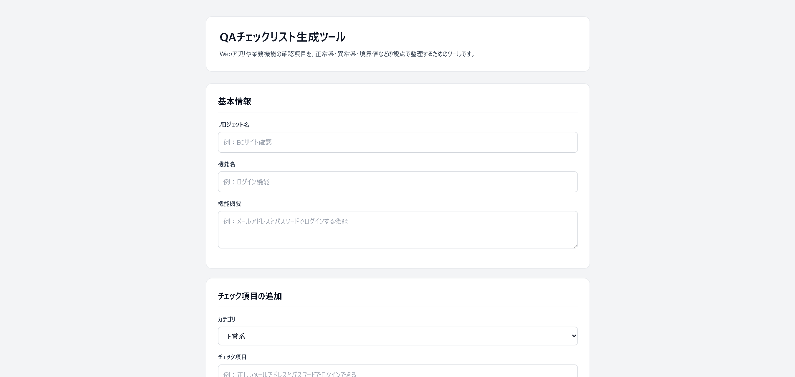
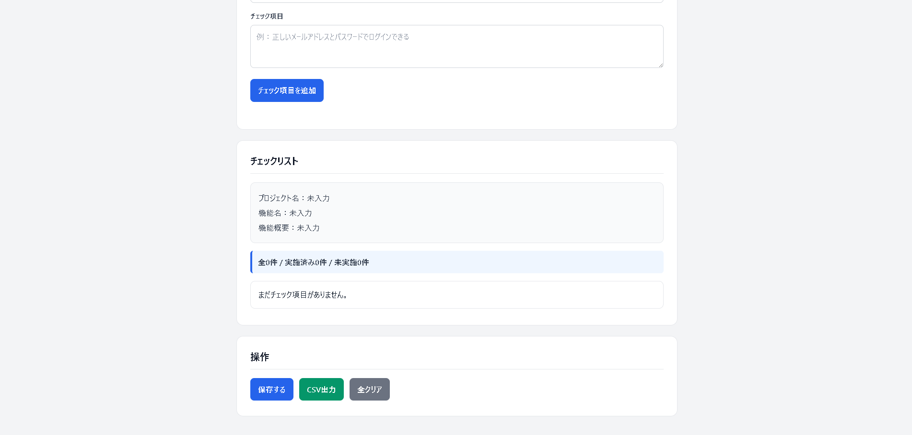

# QAチェックリスト生成ツール

Webアプリや業務機能の確認項目を、正常系・異常系・境界値などの観点で整理するブラウザ完結型ツールです。確認内容を一覧化し、実施状況の保存とCSV共有までを1画面で行えます。

このリポジトリは個人制作のポートフォリオです。実案件への導入実績や複数人での利用実績を示すものではありません。

## デモ

[GitHub Pagesで開く](https://haru-dev-git.github.io/qa-checklist-tool/)

公開ページはmainブランチの内容です。作業ブランチの変更はmerge後に反映されます。

## 解決する課題

- 確認項目をテスト観点ごとに整理したい
- 実施済み・未実施の件数をすぐ把握したい
- ページを閉じても作業内容をブラウザ内に残したい
- 確認内容と結果をCSVで共有・記録したい

## 主な機能

- プロジェクト名、機能名、機能概要の入力
- 正常系・異常系・境界値・表示確認・操作確認・データ保存・その他のカテゴリ分類
- チェック項目の追加、実施状態の切り替え、削除、件数集計
- 必須入力と文字数上限の検証
- `localStorage` への手動保存とページ再読込時の復元
- UTF-8 BOM付きCSV出力（カンマ・改行・ダブルクォートをエスケープ）
- 保存データ破損時やブラウザ保存失敗時のエラー表示

> チェック状態や入力内容を変更した後は、再度「保存する」を押すまで保存内容へ反映されません。

## スクリーンショット





## 使用技術

- HTML / CSS / Vanilla JavaScript
- Web Storage API（`localStorage`）
- Blob APIによるCSV出力
- Node.js標準テストランナー
- ESLint / Prettier
- GitHub Actions

実行時にフレームワーク、外部API、サーバー、データベースは使用しません。

## 動かし方

1. リポジトリをダウンロードまたはcloneします。
2. `index.html` をブラウザで開きます。
3. 基本情報とチェック項目を入力し、「チェック項目を追加」を押します。

保存データはブラウザごとの `localStorage` にだけ保持されます。別ブラウザ・別端末との同期や複数人共有には対応していません。

## 品質チェック

Node.js 22以上を使用します。

```bash
npm ci
npm run check
```

個別にも実行できます。

```bash
npm run lint
npm run format:check
npm test
```

`npm run check` は、lint、フォーマット検査、自動テストを順番に実行します。同じコマンドをGitHub Actionsでも実行します。

## 自動テストの観点

| 対象 | 主な確認内容 |
| --- | --- |
| 入力値検証 | 必須項目、前後空白、上限ちょうど、上限超過 |
| チェック項目 | ID・カテゴリ・本文・初期状態の生成 |
| 集計 | 全件、実施済み、未実施の件数 |
| 保存・復元 | 正常な往復、未保存、不正JSON、不正構造、重複ID、次回ID補正 |
| CSV | ヘッダー、実施状態、カンマ、改行、引用符、ファイル名禁止文字 |

DOM表示に強く依存する操作は過剰に単体テスト化せず、ブラウザで追加・状態切替・保存・再読込・入力エラー・CSV操作をスモーク確認します。

## ポートフォリオとして見てほしい点

- 正常系・異常系・境界値を仕様とテストへ落とし込んでいること
- DOM依存部分とテスト可能なロジックを分離していること
- 壊れた保存データを画面へ反映する前に検証していること
- CSVの文字列エスケープとファイル名の禁止文字を考慮していること
- lint・format・testをローカルとCIで同じコマンドに統一していること
- エラー表示のライブ通知、エラー入力へのフォーカス、削除ボタンの識別名など最低限のアクセシビリティを考慮していること

## 構成

```text
.
├─ index.html                    # 画面構造
├─ style.css                    # 表示とレスポンシブ対応
├─ script.js                    # DOM操作とブラウザAPI連携
├─ app-logic.js                 # 入力検証・保存形式・CSVなどの純粋ロジック
├─ test/app-logic.test.js       # 自動テスト
├─ .github/workflows/ci.yml     # CI
└─ design.md                    # 詳細設計
```

詳細な仕様と見送った機能は[設計書](./design.md)に記載しています。

## AIの利用範囲

企画・要件・実装方針の整理、コードのたたき台、テスト観点、README構成の検討にAIを利用しています。提案内容はそのまま成果とせず、`npm run check` とブラウザスモークテストで実装との整合性を検証しています。存在しない利用実績・業務実績は記載していません。

## 現在の制約

- ログイン、サーバー保存、データベース、複数人共有には未対応
- 保存先は現在のブラウザ内のみ
- CSV読み込み、項目編集、絞り込みには未対応
- CSVのダウンロード可否はブラウザのダウンロード設定に依存
